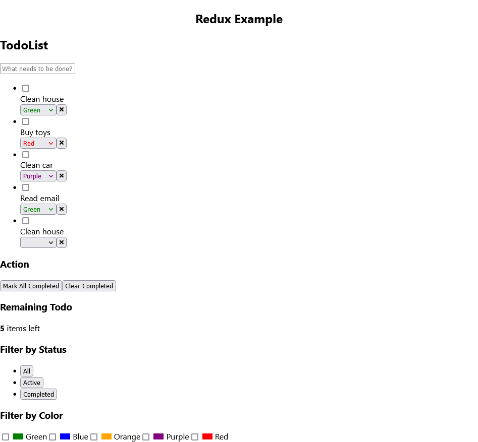

# To-do list for Redux tutorial

## Screenshots

## Built With
* HTML
* CSS
* JavaScript
* ReactJS 18.2
* Redux 4.2

## Features
* Add or delete any task.
* Add a new color filter.
* Mark any task as completed.
* Clear all completed task.
* Filter by status (all tasks, only the active task, or only the completed tasks) or color.

## Install
Install the project dependencies:
...
npm install
...
start the development server
...
npm start
...

## Credits
- Redux Fundamentals: https://redux.js.org/tutorials/fundamentals/part-1-overview
